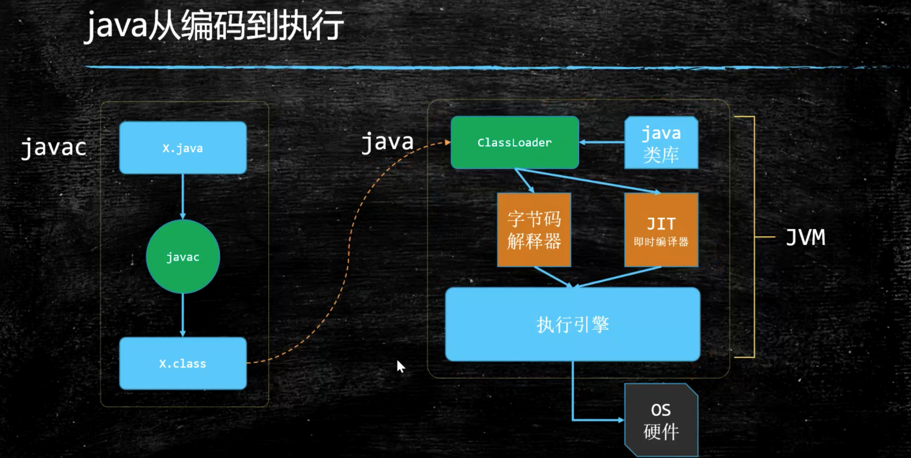
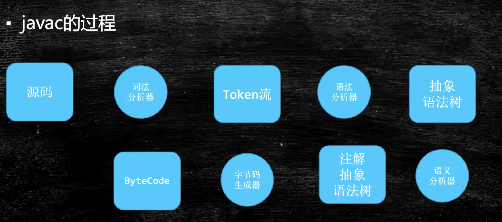

## 目录

不定期更新中……

---

<!--more-->

---

## 什么是 JVM

JVM 全称 Java Virtual Machine，意为 Java 虚拟机。JVM 是软件层面的虚拟机器，需要运行在操作系统之上。JVM 包括一套字节码指令集、一组寄存器、一个栈、一个垃圾回收、一个堆和一个存储方法域。

## Java 文件从编译到执行的过程

Java 文件通过 javac 编译为 class 文件，class 文件和相关 java 类库通过 ClassLoader 加载到内存中，使用字节码解释器和 JIT 及时编译器解析，交由执行引擎进行具体执行。

## javac 的过程

读取源码 >> 词法分析器 >> Token 流 >> 语法分析器 >> 抽象语法树 >> 语义分析器 >> 注解抽象语法树 >> 字节码生成器 >> ByteCode

## JDK、JRE、JVM的关系

- JDK = JRE + Development Kit
- JRE = JVM + Core Lib
- JVM

